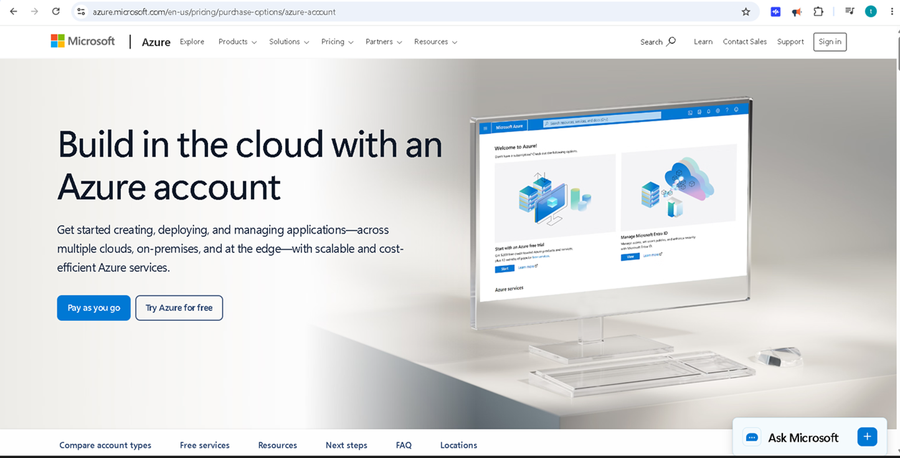
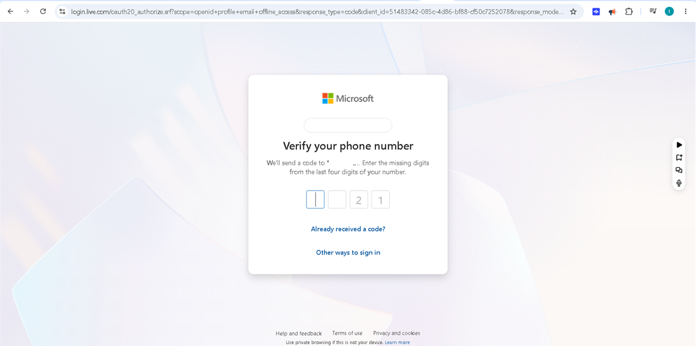
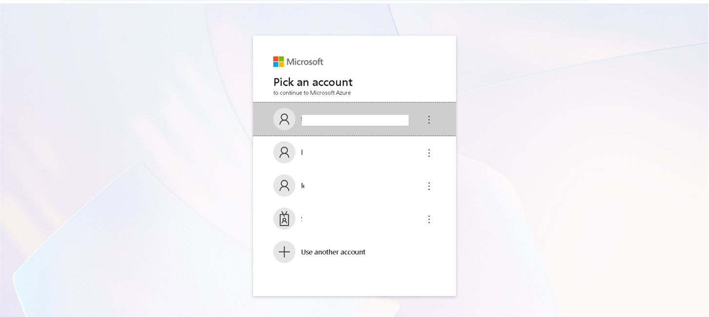
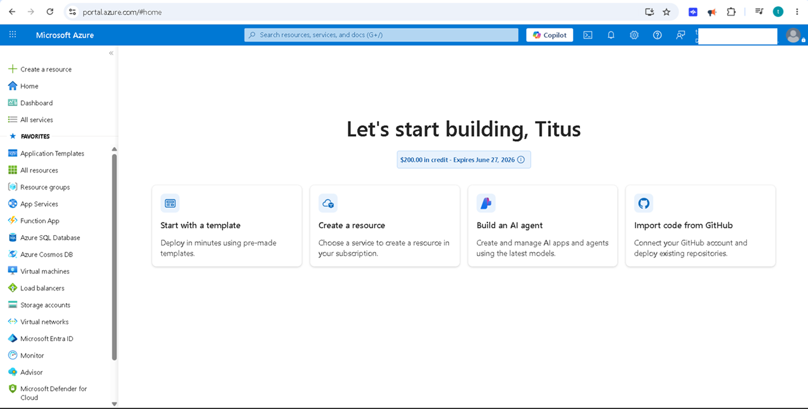
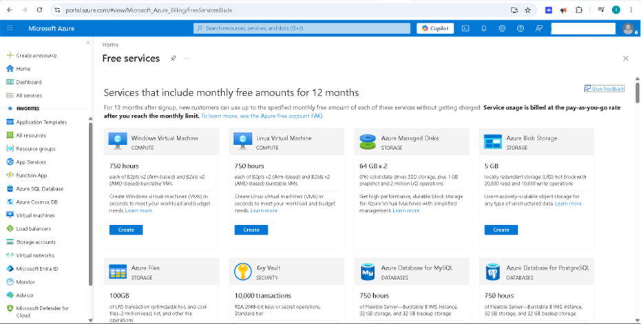
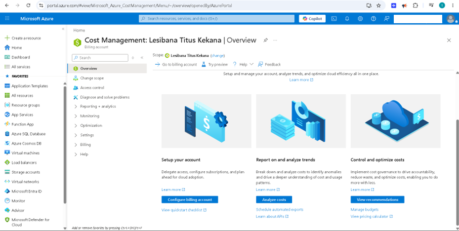
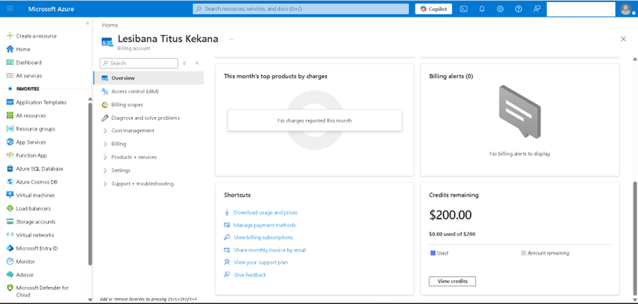

## AZ-900 Lab 01 – My First Steps with Microsoft Azure

## Introduction

This project marks the beginning of my journey into cloud computing with Microsoft Azure.

As someone who is learning Azure Fundamentals (AZ-900), I wanted to move beyond theory and start gaining hands-on experience with the platform. My first task was to create an Azure Free Account, access the Azure Portal, and explore some of the core features available to new users.

Although creating an account sounds simple, it introduced me to several important concepts such as subscriptions, billing, free services, and cost management.

---

## Why I Did This Project

I am currently building practical cloud skills and working towards a stronger understanding of Microsoft Azure.

The purpose of this project was to:

* Create my first Azure account
* Learn how Azure is structured
* Explore the Azure Portal
* Understand subscriptions and billing
* Discover the free resources available for learning

---

## Getting Started

The first step was creating my Azure Free Account.

During the registration process, I learned that Microsoft requires identity verification before granting access to Azure resources. This helps protect the platform and ensures accounts are linked to real users.

---

## Verifying My Account

After signing up, I completed the account verification process.

This was my first exposure to how Microsoft manages access and security for Azure users.

---

## Signing In

Once verification was complete, I signed in using my Microsoft account and gained access to the Azure environment.

At this point, I was officially inside the Azure ecosystem and ready to start exploring.

---

## Learning About Azure Subscriptions

One of the first things I wanted to understand was how Azure organizes resources.

I discovered that everything in Azure revolves around subscriptions. A subscription acts as a container for resources and is also used for billing and access management.

Understanding this concept helped me make sense of how Azure environments are structured.

---

## Exploring Free Services

One of the most exciting parts of this project was exploring the free services available through Azure.

I was surprised by the number of resources Microsoft provides to help beginners learn cloud computing without immediately spending money.

This gave me confidence that I can continue building projects while staying within the free tier.

---

## Understanding Cost Management

Before this project, I never really thought about how cloud costs are monitored.

Azure includes tools that allow users to track spending, review usage, and manage budgets. Exploring these tools showed me how important cost awareness is in cloud environments.

It also helped me understand why organizations place so much emphasis on cloud governance and financial management.

---

## Exploring the Azure Dashboard

I spent time navigating through the Azure Dashboard and getting familiar with the interface.

At first, the portal felt overwhelming because of the number of options available. However, after clicking through different sections and reading the descriptions, the layout started to make sense.

I now have a much better understanding of where to find services, subscriptions, settings, and management tools.

---

## Reviewing My Account

To wrap up the project, I reviewed my account information and explored additional settings available within Azure.

This helped me understand how my Azure account connects to subscriptions, billing, and access management.

---

## What I Learned

This project taught me several important concepts:

* How to create and activate an Azure account
* The role of subscriptions in Azure
* How Azure billing and credits work
* Where to find free Azure services
* The importance of cost management in cloud environments
* How to navigate the Azure Portal

More importantly, it gave me confidence to start working with Azure instead of only reading about it.

---

## Challenges

The biggest challenge was simply becoming familiar with a completely new platform.

Azure contains a large number of services and management tools, which can feel overwhelming when using it for the first time.

By exploring the portal step by step, I became more comfortable navigating the environment and understanding how the different components fit together.

---

## Reflection

This project may seem small, but it was an important milestone in my cloud learning journey.

Creating an Azure account allowed me to move from theory to practical experience. Instead of just learning cloud concepts from textbooks and videos, I was able to explore a real cloud platform and see how those concepts are applied.

I am looking forward to building on this foundation as I continue learning about virtual machines, storage, networking, databases, security, and other Azure services.

---

## Skills Developed

* Microsoft Azure Fundamentals
* Cloud Computing Concepts
* Azure Portal Navigation
* Subscription Management
* Cost Awareness
* Technical Documentation
* Self-Directed Learning

---

## Author

**Lesibana Titus Kekana**

Bachelor of Information Technology in Business Systems

Microsoft Azure Fundamentals (AZ-900) Learning Journey
